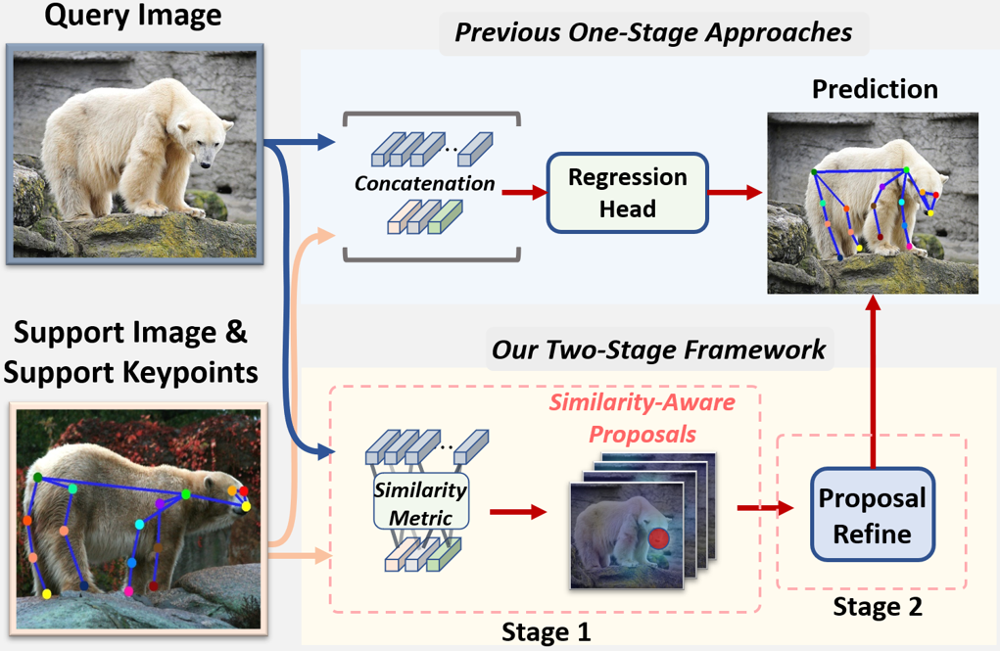

# CapeFormer (CVPR'2023 Highlight)

Official code repository for the paper:  
[**Matching Is Not Enough: A Two-Stage Framework for Category-Agnostic Pose Estimation**](https://openaccess.thecvf.com/content/CVPR2023/papers/Shi_Matching_Is_Not_Enough_A_Two-Stage_Framework_for_Category-Agnostic_Pose_CVPR_2023_paper.pdf)  
[Min Shi*, Zihao Huang*, Xianzheng Ma, Xiaowei Hu, Zhiguo Cao] 
*Equal Contribution

### Abstract
    Category-agnostic pose estimation (CAPE) aims to predict keypoints for arbitrary categories given support images with keypoint annotations. Existing approaches match the keypoints across the image for localization. However, such a one-stage matching paradigm shows inferior accuracy: the prediction heavily relies on the matching results, which can be noisy due to the open set nature in CAPE. For example, two mirror-symmetric keypoints~(e.g., left and right eyes) in the query image can both trigger high similarity on certain support keypoints~(eyes), which leads to duplicated or opposite predictions. To calibrate the inaccurate matching results, we introduce a two-stage framework, where matched keypoints from the first stage are viewed as similarity-aware position proposals. Then, the model learns to fetch relevant features to correct the initial proposals in the second stage. We instantiate the framework with a transformer model tailored for CAPE. The transformer encoder incorporates specific designs to improve the representation and similarity modeling in the first matching stage. In the second stage, similarity-aware proposals are packed as queries in the decoder for refinement via cross-attention. Our method surpasses the previous best approach by large margins on CAPE benchmark MP-100 on both accuracy and efficiency. Code available at https://github.com/flyinglynx/CapeFormer 



## Usage

### Install
We train and evaluate our model on Python 3.8 and Pytorch 1.8.1 with CUDA 11.1. Other versions can probably work. Please first install pytorch and torchvision following official documentation [Pytorch](https://pytorch.org/get-started/previous-versions/). Then, prepare the following packages:
```
mmcv-full=1.5.3
mmpose=0.28.1
```
Having installed these packages, run `python setup.py develop`.

### Data preparation
Please follow the [official guide](https://github.com/luminxu/Pose-for-Everything) to prepare the MP-100 dataset for training and evaluation, and organize the data structure properly. 

### Training
Training CAPEFormer on 1-shot setting only need one GPU (>12GB memory). To train the model, first specify the data path and output directory in the configuration file. Here we show an example of training CAPEFormer on MP-100 dataset split1. 
Please modify the `data_root` at line 135 in `configs\mp100\capeformer\1shots\two_stage_split1_config.py` according to your data path. You can specifiy the GPU by `export CUDA_VISIBLE_DEVICES=0`, then run the following command:
```shell
python train.py --config configs\mp100\capeformer\1shots\two_stage_split1_config.py --work-dir ${SAVE_PATH}
```

#### Train with a single GPU
```shell
python train.py --config ${CONFIG_FILE} --work-dir ${SAVE_PATH} [optional arguments]
```

#### Train with multiple GPUs with pytorch distributed backend
```shell
./tools/dist_train.sh ${CONFIG_FILE} ${GPU_NUM} ${SAVE_PATH}
```

### Test
You can download the 1-shot pretrained checkpoints from following table.
|   Setting  |  split 1 | split 2 | split 3 | split 4 | split 5 |
|:----------:|:--------:|:-------:|:-------:|:-------:|:-------:|
| 1-shot PCK |   89.45  |  84.88  |  83.59  |  83.59  |  85.09  |
| Checkpoint | [link](https://github.com/flyinglynx/CapeFormer/releases/download/checkpoints-mp100/capeformer-split1-1shot-4c40dfd2_20230713.pth) |   [link](https://github.com/flyinglynx/CapeFormer/releases/download/checkpoints-mp100/capeformer-split2-1shot-d20d76e1_20230713.pth) |   [link](https://github.com/flyinglynx/CapeFormer/releases/download/checkpoints-mp100/capeformer-split3-1shot-4d9b6534_20230713.pth)  |   [link](https://github.com/flyinglynx/CapeFormer/releases/download/checkpoints-mp100/capeformer-split4-1shot-be9aca13_20230713.pth)  |   [link](https://github.com/flyinglynx/CapeFormer/releases/download/checkpoints-mp100/capeformer-split5-1shot-d0da75a9_20230713.pth)  |

The 5-shot checkpoints for CAPEFormer can be found in this table
|   Setting  |  split 1 | split 2 | split 3 | split 4 | split 5 |
|:----------:|:--------:|:-------:|:-------:|:-------:|:-------:|
| 5-shot PCK |   91.94  |  88.92  |  89.40  |  88.01  |  88.25  |
| Checkpoint | [link](https://github.com/flyinglynx/CapeFormer/releases/download/checkpoints-mp100/capeformer-split1-5shot-e7048c6a_20230713.pth) |   [link](https://github.com/flyinglynx/CapeFormer/releases/download/checkpoints-mp100/capeformer-split2-5shot-9129de4c_20230713.pth)  |   [link](https://github.com/flyinglynx/CapeFormer/releases/download/checkpoints-mp100/capeformer-split3-5shot-9d997848_20230713.pth)  |   [link](https://github.com/flyinglynx/CapeFormer/releases/download/checkpoints-mp100/capeformer-split4-5shot-19aafbd1_20230713.pth)  |   [link](https://github.com/flyinglynx/CapeFormer/releases/download/checkpoints-mp100/capeformer-split5-5shot-05b04273_20230713.pth)  |

#### Test with a single GPU
The evaluation on a single GPU will cost approximatly 40min. After organizing the data and the pre-trained checkpoints, you can run the following commands for testing:
```shell
python test.py ${CONFIG_FILE} ${CHECKPOINT_FILE} [optional arguments]
```

## Citation
```bibtex
@inproceedings{shi2023matching,
  title={Matching Is Not Enough: A Two-Stage Framework for Category-Agnostic Pose Estimation},
  author={Shi, Min and Huang, Zihao and Ma, Xianzheng and Hu, Xiaowei and Cao, Zhiguo},
  booktitle={Proceedings of the IEEE/CVF Conference on Computer Vision and Pattern Recognition},
  pages={7308--7317},
  year={2023}
}
```

## Acknowledgement

Thanks to:

- [MMPose](https://github.com/open-mmlab/mmpose)
- [Pose-for-Everything](https://github.com/luminxu/Pose-for-Everything)

## License

This project is released under the [Apache 2.0 license](LICENSE).
